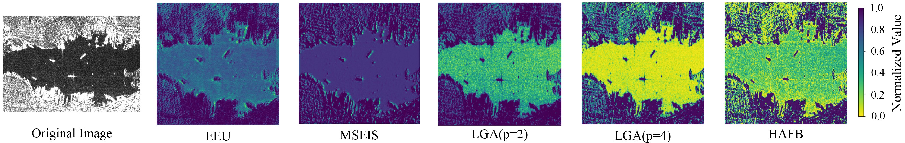

# Robust SAR Ship Detection in Complex Backgrounds with Few-Shot Learning

## 📖 Abstract
Synthetic Aperture Radar (SAR) ship detection is crucial for maritime surveillance but is hindered by speckle noise, complex sea clutter, and the demand for precise edge localization. To address these challenges, we propose a novel deep neural network composed of three specialized modules:

1. **Multi-Scale Edge Information Selection (MSEIS) module:** This module, with its Edge Enhancement Unit (EEU), extracts and refines edge details across multiple scales.
2. **Cross-Domain Feature Gating (CDFG) mechanism:** This enhances target contrast by focusing on strong scattering responses while suppressing noise.
3. **Hierarchical Attention Fusion Block (HAFB):** This combines local and global contextual features for effective multi-scale feature fusion.

Extensive experiments on the **SSDD**, **RSDD-SAR**, and **HRSID** datasets demonstrate that our model achieves state-of-the-art detection accuracy. 

[[Paper PDF](./paper.pdf)] (coming soon)  
[[Project Page](https://github.com/ZJ-Song-Lab/MSEIS_HAFB)]

---

## 🚀 Features
- **Robustness:**The model effectively detects ships in SAR images, handling challenges like speckle noise and sea clutter with high accuracy.
- **Enhanced Features:** It uses specialized modules to enhance multi-scale features, improve edge detection, and fuse information from different levels.
- **Few-Shot Learning:**The model can perform well even with a limited number of training examples, making it highly adaptable for real-world use.

## ⚙️ Installation
```bash
# Clone the repository
git clone https://github.com/ZJ-Song-Lab/MSEIS_HAFB.git
cd FSDD

# Install dependencies
pip install -r requirements.txt
```

---

## 🏋️ Training
```bash
# Example training command
python train.py --data configs/ssdd.yaml --epochs 300 --batch 16 --device 0
```

---

## 🔍 Evaluation
```bash
# Run evaluation
python val.py --data configs/ssdd.yaml --weights runs/train/exp/weights/best.pt
```

---

---

## 📸 Visualization
Detection results under **coastal clutter** and **open-sea scenarios**:



---


oject Page**: [GitHub](https://github.com/ZJ-Song-Lab/MSEIS_HAFB)

---

## 📜 License
This project is released under the **MIT License**. See [LICENSE](./LICENSE) for details.
